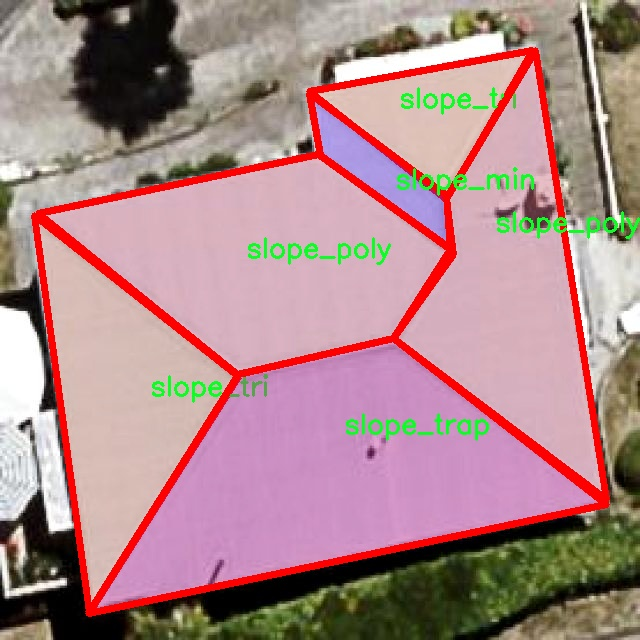

# 屋顶类型分割系统： yolov8-seg-C2f-Faster

### 1.研究背景与意义

[参考博客](https://gitee.com/YOLOv8_YOLOv11_Segmentation_Studio/projects)

[博客来源](https://kdocs.cn/l/cszuIiCKVNis)

研究背景与意义

随着城市化进程的加快，屋顶类型的多样性与复杂性日益凸显。屋顶不仅是建筑的重要组成部分，其形态、材料和结构直接影响着城市的美观、功能及生态环境。因此，准确识别和分类不同类型的屋顶，对于城市规划、建筑设计、环境监测等领域具有重要的现实意义。传统的屋顶分类方法多依赖人工经验，效率低且容易受到主观因素的影响，难以满足现代城市管理的需求。近年来，深度学习技术的迅猛发展为图像处理和物体识别提供了新的解决方案，尤其是基于卷积神经网络（CNN）的目标检测与分割技术在图像分析领域取得了显著的成果。

YOLO（You Only Look Once）系列模型因其高效的实时检测能力而广泛应用于各种视觉任务。YOLOv8作为该系列的最新版本，结合了更为先进的网络结构和优化算法，能够在保证检测精度的同时，显著提高处理速度。然而，尽管YOLOv8在一般目标检测任务中表现优异，但在特定领域如屋顶类型分割时，仍然面临着诸多挑战。屋顶的多样性和复杂性使得模型在不同类型屋顶的识别上存在一定的局限性。因此，基于改进YOLOv8的屋顶类型分割系统的研究，旨在通过针对性优化，提升模型在屋顶分割任务中的表现。

本研究所使用的数据集“Roof_Segmentation_1”包含1000幅图像，涵盖了五种不同类型的屋顶：平屋顶（slope_flat）、小坡屋顶（slope_min）、多坡屋顶（slope_poly）、梯形屋顶（slope_trap）和三角屋顶（slope_tri）。这些类别的划分不仅体现了屋顶形态的多样性，也为模型的训练提供了丰富的样本。通过对这些数据的深入分析与处理，能够有效提高模型对不同屋顶类型的识别能力，进而实现更为精确的屋顶分割。

本研究的意义在于，首先，推动屋顶类型分割技术的发展，为城市管理、建筑设计等领域提供更为高效的工具。其次，通过改进YOLOv8的算法，探索深度学习在特定应用场景中的适应性与灵活性，为后续研究提供借鉴。此外，本研究还将为相关领域的研究者提供一个高质量的数据集，促进屋顶分割技术的交流与合作。最后，随着智能城市建设的推进，屋顶类型的精确识别将为城市的可持续发展提供重要的数据支持，助力实现更为科学的城市规划与管理。

综上所述，基于改进YOLOv8的屋顶类型分割系统的研究，不仅具有重要的理论价值，也具备广泛的应用前景。通过这一研究，期望能够为城市的可持续发展贡献一份力量，同时推动计算机视觉技术在实际应用中的不断进步与创新。

### 2.图片演示


注意：本项目提供完整的训练源码数据集和训练教程,由于此博客编辑较早,暂不提供权重文件（best.pt）,需要按照6.训练教程进行训练后实现上图效果。

### 3.视频演示

[3.1 视频演示](https://www.bilibili.com/video/BV1usmXYWEwp/)

### 4.数据集信息

##### 4.1 数据集类别数＆类别名

nc: 5
names: ['slope_flat', 'slope_min', 'slope_poly', 'slope_trap', 'slope_tri']


##### 4.2 数据集信息简介

数据集信息展示

在本研究中，我们使用了名为“Roof_Segmentation_1”的数据集，以训练和改进YOLOv8-seg模型，旨在实现高效的屋顶类型分割系统。该数据集专注于不同类型的屋顶结构，具有丰富的多样性和代表性，能够为模型的训练提供坚实的基础。数据集包含五个主要类别，分别为：斜面平屋顶（slope_flat）、斜面最小屋顶（slope_min）、斜面多边形屋顶（slope_poly）、斜面梯形屋顶（slope_trap）和斜面三角屋顶（slope_tri）。这些类别的选择不仅反映了现实世界中屋顶设计的多样性，也为模型提供了足够的挑战性，以提升其分割精度和泛化能力。

“Roof_Segmentation_1”数据集的构建经过精心设计，确保每个类别的样本数量均衡且多样化。斜面平屋顶作为最常见的屋顶类型，其样本涵盖了不同的建筑风格和材料，能够有效地帮助模型学习到平屋顶的特征。斜面最小屋顶则代表了一种相对简单的设计，样本中包含了多种色彩和纹理，旨在增强模型对细微差别的识别能力。斜面多边形屋顶则提供了更为复杂的几何形状，挑战模型在分割时的准确性。斜面梯形屋顶和斜面三角屋顶则进一步丰富了数据集的多样性，确保模型能够处理不同形状和结构的屋顶。

在数据集的准备过程中，所有样本均经过严格的标注，以确保每个屋顶类型的准确性和一致性。标注过程采用了专业的图像标注工具，确保每个屋顶的边界清晰可辨。通过高质量的标注，模型在训练过程中能够获得更为准确的反馈，从而提升其分割性能。此外，数据集还包含了不同光照条件、天气状况和视角下的屋顶图像，这使得模型在面对现实世界中的复杂情况时，能够表现出更强的鲁棒性。

为了进一步增强模型的学习能力，数据集还采用了数据增强技术，包括旋转、缩放、翻转等操作，以增加样本的多样性和数量。这种方法不仅能够有效防止模型的过拟合现象，还能提高其在未知数据上的泛化能力。通过这些精心设计的策略，“Roof_Segmentation_1”数据集为YOLOv8-seg模型的训练提供了丰富的素材，确保模型能够在屋顶类型分割任务中达到更高的准确率和效率。

总之，“Roof_Segmentation_1”数据集的构建和应用为改进YOLOv8-seg的屋顶类型分割系统奠定了坚实的基础。通过对五个屋顶类别的深入分析和精细标注，结合数据增强技术的应用，我们期望模型能够在实际应用中实现更高的分割精度，为建筑设计、城市规划等领域提供有力的支持。随着研究的深入，我们相信该数据集将为未来的屋顶类型分割研究提供宝贵的参考和借鉴。





### 5.项目依赖环境部署教程（零基础手把手教学）

[5.1 环境部署教程链接（零基础手把手教学）](https://www.bilibili.com/video/BV1jG4Ve4E9t/?vd_source=bc9aec86d164b67a7004b996143742dc)


[5.2 安装Python虚拟环境创建和依赖库安装视频教程链接（零基础手把手教学）](https://www.bilibili.com/video/BV1nA4VeYEze/?vd_source=bc9aec86d164b67a7004b996143742dc)

### 6.手把手YOLOV8-seg训练视频教程（零基础手把手教学）

[6.1 手把手YOLOV8-seg训练视频教程（零基础小白有手就能学会）](https://www.bilibili.com/video/BV1cA4VeYETe/?vd_source=bc9aec86d164b67a7004b996143742dc)


按照上面的训练视频教程链接加载项目提供的数据集，运行train.py即可开始训练



     Epoch   gpu_mem       box       obj       cls    labels  img_size
     1/200     0G   0.01576   0.01955  0.007536        22      1280: 100%|██████████| 849/849 [14:42<00:00,  1.04s/it]
               Class     Images     Labels          P          R     mAP@.5 mAP@.5:.95: 100%|██████████| 213/213 [01:14<00:00,  2.87it/s]
                 all       3395      17314      0.994      0.957      0.0957      0.0843

     Epoch   gpu_mem       box       obj       cls    labels  img_size
     2/200     0G   0.01578   0.01923  0.007006        22      1280: 100%|██████████| 849/849 [14:44<00:00,  1.04s/it]
               Class     Images     Labels          P          R     mAP@.5 mAP@.5:.95: 100%|██████████| 213/213 [01:12<00:00,  2.95it/s]
                 all       3395      17314      0.996      0.956      0.0957      0.0845

     Epoch   gpu_mem       box       obj       cls    labels  img_size
     3/200     0G   0.01561    0.0191  0.006895        27      1280: 100%|██████████| 849/849 [10:56<00:00,  1.29it/s]
               Class     Images     Labels          P          R     mAP@.5 mAP@.5:.95: 100%|███████   | 187/213 [00:52<00:00,  4.04it/s]
                 all       3395      17314      0.996      0.957      0.0957      0.0845


### 7.50+种全套YOLOV8-seg创新点加载调参实验视频教程（一键加载写好的改进模型的配置文件）

[7.1 50+种全套YOLOV8-seg创新点加载调参实验视频教程（一键加载写好的改进模型的配置文件）](https://www.bilibili.com/video/BV1Hw4VePEXv/?vd_source=bc9aec86d164b67a7004b996143742dc)

### YOLOV8-seg算法简介

原始YOLOv8-seg算法原理

YOLOv8-seg算法是Ultralytics团队在YOLO系列模型的基础上进行的一次重要升级，旨在提升目标检测和图像分割的性能。自2023年1月推出以来，YOLOv8-seg吸收了YOLOv5和YOLOv7的多项创新设计，结合了深度学习领域的最新研究成果，展现出更高的准确性和效率。其设计理念围绕着快速、准确和易于使用的原则，使其在各种应用场景中都能发挥出色的性能。

YOLOv8-seg的网络结构由输入层、主干网络、特征融合层和解耦头组成，构成了一个完整的目标检测和分割系统。输入层的设计考虑到了实际应用中的图像长宽比差异，采用自适应图片缩放策略，确保在进行目标检测时尽量减少信息冗余。该算法在训练过程中引入了Mosaic数据增强技术，通过将多张图像拼接成一张新图像，增强了模型的鲁棒性和泛化能力。然而，为了避免数据分布的失真，YOLOv8-seg在训练的最后10个epoch中停止使用Mosaic增强，确保模型能够更好地学习真实数据的特征。

在主干网络方面，YOLOv8-seg对C3模块进行了改进，采用了C2f模块。C2f模块的设计灵感来源于YOLOv7中的ELAN结构，增加了更多的跳层连接，极大地丰富了梯度流信息。这种设计不仅提高了模型的学习能力，还在保持轻量化的同时，确保了检测精度。C2f模块的结构由多个CBS（卷积+归一化+激活）模块和若干个BottleNeck模块组成，通过并行的特征提取路径，增强了特征的重用和融合能力，进而提升了模型的整体性能。

在特征融合层，YOLOv8-seg采用了PAN-FPN结构，进一步增强了多尺度特征的融合能力。该结构通过自下而上的特征融合，结合了高层特征和中层特征的信息，确保了在不同尺度下的目标检测效果。通过去除上采样前的卷积连接层，YOLOv8-seg实现了更高效的特征传递，使得每一层的特征图都能够充分利用来自不同层次的语义信息。

YOLOv8-seg的头部网络设计则采用了解耦头的思想，将分类和回归任务分开处理。通过引入两个并行的分支，分别负责类别特征和位置特征的提取，模型在收敛速度和预测精度上都有了显著提升。此外，YOLOv8-seg抛弃了传统的锚框结构，转而采用无锚框的设计，使得目标检测的过程更加灵活。无锚框方法将目标检测转化为关键点检测，避免了预设锚框的复杂性，提高了模型的泛化能力。

在损失函数的设计上，YOLOv8-seg引入了VFLLoss和DFLLoss+CIoULoss的组合，旨在优化分类和回归的性能。VFLLoss用于处理分类任务，DFLLoss和CIoULoss则用于边界框的回归，确保模型在定位和分类方面都能取得良好的效果。此外，YOLOv8-seg还引入了任务对齐学习（Task Alignment Learning），通过对正负样本的区分和高次幂乘积的引入，进一步提升了模型的训练效果。

YOLOv8-seg在实际应用中表现出色，尤其是在目标检测和图像分割的任务中，展现了优于前代模型的性能。通过对COCO数据集的测试，YOLOv8-seg在不同尺寸的模型中，均取得了较高的mAP（mean Average Precision）值，验证了其在准确性和推理速度上的优势。尤其是在实时性要求较高的场景中，YOLOv8-seg能够以较快的速度完成目标检测任务，适用于机器人视觉、自动驾驶、监控等多个领域。

综上所述，YOLOv8-seg算法通过对网络结构的优化、特征融合的增强以及损失函数的改进，成功实现了目标检测和图像分割的高效结合。其创新的设计思路和强大的性能，使其成为当前目标检测领域的重要工具，具有广泛的研究和应用价值。随着YOLOv8-seg的不断发展和完善，未来有望在更多实际应用中发挥更大的作用。


### 9.系统功能展示（检测对象为举例，实际内容以本项目数据集为准）

图9.1.系统支持检测结果表格显示

  图9.2.系统支持置信度和IOU阈值手动调节

  图9.3.系统支持自定义加载权重文件best.pt(需要你通过步骤5中训练获得)

  图9.4.系统支持摄像头实时识别

  图9.5.系统支持图片识别

  图9.6.系统支持视频识别

  图9.7.系统支持识别结果文件自动保存

  图9.8.系统支持Excel导出检测结果数据


### 10.50+种全套YOLOV8-seg创新点原理讲解（非科班也可以轻松写刊发刊，V11版本正在科研待更新）

#### 10.1 由于篇幅限制，每个创新点的具体原理讲解就不一一展开，具体见下列网址中的创新点对应子项目的技术原理博客网址【Blog】：


[10.1 50+种全套YOLOV8-seg创新点原理讲解链接](https://gitee.com/qunmasj/good)

#### 10.2 部分改进模块原理讲解(完整的改进原理见上图和技术博客链接)【如果此小节的图加载失败可以通过CSDN或者Github搜索该博客的标题访问原始博客，原始博客图片显示正常】
### YOLOv8算法原理
YOLOv8算法由Glenn-Jocher 提出，是跟YOLOv3算法、YOLOv5算法一脉相承的，主要的改进点如下:
(1)数据预处理。YOLOv8的数据预处理依旧采用YOLOv5的策略,在训练时，主要采用包括马赛克增强(Mosaic)、混合增强(Mixup)、空间扰动(randomperspective)以及颜色扰动(HSV augment)四个增强手段。
(2)骨干网络结构。YOLOv8的骨干网络结构可从YOLOv5略见一斑，YOLOv5的主干网络的架构规律十分清晰，总体来看就是每用一层步长为2的3×3卷积去降采样特征图，接一个C3模块来进一步强化其中的特征，且C3的基本深度参数分别为“3/6/9/3”，其会根据不同规模的模型的来做相应的缩放。在的YOLOv8中，大体上也还是继承了这一特点，原先的C3模块均被替换成了新的C2f模块，C2f 模块加入更多的分支，丰富梯度回传时的支流。下面展示了YOLOv8的C2f模块和YOLOv5的C3模块，其网络结构图所示。


(3)FPN-PAN结构。YOLOv8仍采用FPN+PAN结构来构建YOLO的特征金字塔，使多尺度信息之间进行充分的融合。除了FPN-PAN里面的C3模块被替换为C2f模块外，其余部分与YOLOv5的FPN-PAN结构基本一致。
(4)Detection head结构。从 YOLOv3到 YOLOv5，其检测头一直都是“耦合”(Coupled)的,即使用一层卷积同时完成分类和定位两个任务，直到YOLOX的问世， YOLO系列才第一次换装“解耦头”(Decoupled Head)。YOLOv8也同样也采用了解耦头的结构，两条并行的分支分别取提取类别特征和位置特征，然后各用一层1x1卷积完成分类和定位任务。YOLOv8整体的网络结构由图所示。


(5)标签分配策略。尽管YOLOv5设计了自动聚类候选框的一些功能，但是聚类候选框是依赖于数据集的。若数据集不够充分，无法较为准确地反映数据本身的分布特征，聚类出来的候选框也会与真实物体尺寸比例悬殊过大。YOLOv8没有采用候选框策略，所以解决的问题就是正负样本匹配的多尺度分配。不同于YOLOX所使用的 SimOTA，YOLOv8在标签分配问题上采用了和YOLOv6相同的TOOD策略，是一种动态标签分配策略。YOLOv8只用到了targetboze。和target scores，未含是否有物体预测，故 YOLOv8的损失就主要包括两大部分∶类别损失和位置损失。对于YOLOv8，其分类损失为VFLLoss(Varifocal Loss)，其回归损失为CIoU Loss 与 DFL Loss 的形式。
其中 Varifocal Loss定义如下:


其中p为预测的类别得分，p ∈ [0.1]。q为预测的目标分数(若为真实类别，则q为预测和真值的 loU;若为其他类别。q为0 )。VFL Loss使用不对称参数来对正负样本进行加权，通过只对负样本进行衰减，达到不对等的处理前景和背景对损失的贡献。对正样本，使用q进行了加权，如果正样本的GTiou很高时,则对损失的贡献更大一些，可以让网络聚焦于那些高质量的样本上，即训练高质量的正例对AP的提升比低质量的更大一些。对负样本，使用p进行了降权，降低了负例对损失的贡献，因负样本的预测p在取次幂后会变得更小，这样就能够降低负样本对损失的整体贡献。

### 动态蛇形卷积Dynamic Snake Convolution

参考论文： 2307.08388.pdf (arxiv.org)

血管、道路等拓扑管状结构的精确分割在各个领域都至关重要，确保下游任务的准确性和效率。 然而，许多因素使任务变得复杂，包括薄的局部结构和可变的全局形态。在这项工作中，我们注意到管状结构的特殊性，并利用这些知识来指导我们的 DSCNet 在三个阶段同时增强感知：特征提取、特征融合、 和损失约束。 首先，我们提出了一种动态蛇卷积，通过自适应地关注细长和曲折的局部结构来准确捕获管状结构的特征。 随后，我们提出了一种多视图特征融合策略，以补充特征融合过程中多角度对特征的关注，确保保留来自不同全局形态的重要信息。 最后，提出了一种基于持久同源性的连续性约束损失函数，以更好地约束分割的拓扑连续性。 2D 和 3D 数据集上的实验表明，与多种方法相比，我们的 DSCNet 在管状结构分割任务上提供了更好的准确性和连续性。 我们的代码是公开的。 
主要的挑战源于细长微弱的局部结构特征与复杂多变的全局形态特征。本文关注到管状结构细长连续的特点，并利用这一信息在神经网络以下三个阶段同时增强感知：特征提取、特征融合和损失约束。分别设计了动态蛇形卷积（Dynamic Snake Convolution），多视角特征融合策略与连续性拓扑约束损失。 

我们希望卷积核一方面能够自由地贴合结构学习特征，另一方面能够在约束条件下不偏离目标结构太远。在观察管状结构的细长连续的特征后，脑海里想到了一个动物——蛇。我们希望卷积核能够像蛇一样动态地扭动，来贴合目标的结构。

我们希望卷积核一方面能够自由地贴合结构学习特征，另一方面能够在约束条件下不偏离目标结构太远。在观察管状结构的细长连续的特征后，脑海里想到了一个动物——蛇。我们希望卷积核能够像蛇一样动态地扭动，来贴合目标的结构。


### DCNV2融入YOLOv8
DCN和DCNv2（可变性卷积）
网上关于两篇文章的详细描述已经很多了，我这里具体的细节就不多讲了，只说一下其中实现起来比较困惑的点。（黑体字会讲解）

DCNv1解决的问题就是我们常规的图像增强，仿射变换（线性变换加平移）不能解决的多种形式目标变换的几何变换的问题。如下图所示。

可变性卷积的思想很简单，就是讲原来固定形状的卷积核变成可变的。如下图所示：


首先来看普通卷积，以3x3卷积为例对于每个输出y(p0)，都要从x上采样9个位置，这9个位置都在中心位置x(p0)向四周扩散得到的gird形状上，(-1,-1)代表x(p0)的左上角，(1,1)代表x(p0)的右下角，其他类似。

用公式表示如下：


可变性卷积Deformable Conv操作并没有改变卷积的计算操作，而是在卷积操作的作用区域上，加入了一个可学习的参数∆pn。同样对于每个输出y(p0)，都要从x上采样9个位置，这9个位置是中心位置x(p0)向四周扩散得到的，但是多了 ∆pn，允许采样点扩散成非gird形状。


偏移量是通过对原始特征层进行卷积得到的。比如输入特征层是w×h×c，先对输入的特征层进行卷积操作，得到w×h×2c的offset field。这里的w和h和原始特征层的w和h是一致的，offset field里面的值是输入特征层对应位置的偏移量，偏移量有x和y两个方向，所以offset field的channel数是2c。offset field里的偏移量是卷积得到的，可能是浮点数，所以接下来需要通过双向性插值计算偏移位置的特征值。在偏移量的学习中，梯度是通过双线性插值来进行反向传播的。
看到这里是不是还是有点迷茫呢？那到底程序上面怎么实现呢？


事实上由上面的公式我们可以看得出来∆pn这个偏移量是加在原像素点上的，但是我们怎么样从代码上对原像素点加这个量呢？其实很简单，就是用一个普通的卷积核去跟输入图片（一般是输入的feature_map）卷积就可以了卷积核的数量是2N也就是23*3==18（前9个通道是x方向的偏移量，后9个是y方向的偏移量），然后把这个卷积的结果与正常卷积的结果进行相加就可以了。
然后又有了第二个问题，怎么样反向传播呢？为什么会有这个问题呢？因为求出来的偏移量+正常卷积输出的结果往往是一个浮点数，浮点数是无法对应到原图的像素点的，所以自然就想到了双线性差值的方法求出浮点数对应的浮点像素点。


#### DCN v2
对于positive的样本来说，采样的特征应该focus在RoI内，如果特征中包含了过多超出RoI的内容，那么结果会受到影响和干扰。而negative样本则恰恰相反，引入一些超出RoI的特征有助于帮助网络判别这个区域是背景区域。

DCNv1引入了可变形卷积，能更好的适应目标的几何变换。但是v1可视化结果显示其感受野对应位置超出了目标范围，导致特征不受图像内容影响（理想情况是所有的对应位置分布在目标范围以内）。

为了解决该问题：提出v2, 主要有

1、扩展可变形卷积，增强建模能力
2、提出了特征模拟方案指导网络培训：feature mimicking scheme

上面这段话是什么意思呢，通俗来讲就是，我们的可变性卷积的区域大于目标所在区域，所以这时候就会对非目标区域进行错误识别。

所以自然能想到的解决方案就是加入权重项进行惩罚。（至于这个实现起来就比较简单了，直接初始化一个权重然后乘(input+offsets)就可以了）


可调节的RoIpooling也是类似的，公式如下：


### 11.项目核心源码讲解（再也不用担心看不懂代码逻辑）

#### 11.1 ultralytics\models\yolo\classify\predict.py

以下是对代码的核心部分进行提炼和详细注释的结果：

```python
# 导入必要的库
import torch
from ultralytics.engine.predictor import BasePredictor
from ultralytics.engine.results import Results
from ultralytics.utils import DEFAULT_CFG, ops

class ClassificationPredictor(BasePredictor):
    """
    ClassificationPredictor类用于基于分类模型进行预测，继承自BasePredictor类。

    注意：
        - 可以将Torchvision分类模型传递给'model'参数，例如：model='resnet18'。
    """

    def __init__(self, cfg=DEFAULT_CFG, overrides=None, _callbacks=None):
        """初始化ClassificationPredictor，将任务设置为'分类'。"""
        super().__init__(cfg, overrides, _callbacks)  # 调用父类构造函数
        self.args.task = 'classify'  # 设置任务类型为分类

    def preprocess(self, img):
        """将输入图像转换为模型兼容的数据类型。"""
        # 如果输入不是torch.Tensor类型，则进行转换
        if not isinstance(img, torch.Tensor):
            img = torch.stack([self.transforms(im) for im in img], dim=0)  # 应用转换并堆叠成一个Tensor
        # 将图像移动到模型所在的设备（CPU或GPU）
        img = (img if isinstance(img, torch.Tensor) else torch.from_numpy(img)).to(self.model.device)
        # 根据模型的精度设置返回图像类型（fp16或fp32）
        return img.half() if self.model.fp16 else img.float()  # 将uint8转换为fp16/32

    def postprocess(self, preds, img, orig_imgs):
        """对预测结果进行后处理，返回Results对象。"""
        # 如果原始图像不是列表，则将其转换为numpy数组
        if not isinstance(orig_imgs, list):
            orig_imgs = ops.convert_torch2numpy_batch(orig_imgs)

        results = []  # 存储结果的列表
        # 遍历每个预测结果
        for i, pred in enumerate(preds):
            orig_img = orig_imgs[i]  # 获取原始图像
            img_path = self.batch[0][i]  # 获取图像路径
            # 创建Results对象并添加到结果列表中
            results.append(Results(orig_img, path=img_path, names=self.model.names, probs=pred))
        return results  # 返回处理后的结果列表
```

### 代码核心部分说明：
1. **类定义**：`ClassificationPredictor`类继承自`BasePredictor`，用于处理分类任务。
2. **初始化方法**：在构造函数中设置任务类型为分类，并调用父类的构造函数进行初始化。
3. **预处理方法**：`preprocess`方法将输入图像转换为模型所需的格式，包括数据类型转换和设备迁移。
4. **后处理方法**：`postprocess`方法将模型的预测结果与原始图像结合，返回一个包含预测结果的`Results`对象列表。

这个文件是Ultralytics YOLO框架中的一个分类预测模块，主要用于基于分类模型进行图像分类的预测。文件中首先导入了必要的库，包括PyTorch和Ultralytics框架中的一些核心组件。

在文件中定义了一个名为`ClassificationPredictor`的类，它继承自`BasePredictor`类。这个类的主要功能是扩展基础预测器，以便能够处理分类任务。类的文档字符串中提到，可以将Torchvision的分类模型（例如`resnet18`）作为模型参数传入。使用示例展示了如何初始化一个`ClassificationPredictor`对象，并通过命令行接口进行预测。

在构造函数`__init__`中，调用了父类的初始化方法，并将任务类型设置为“classify”，表示该预测器将用于分类任务。

`preprocess`方法负责对输入图像进行预处理，以便将其转换为模型所需的数据类型。首先，它检查输入是否为PyTorch张量，如果不是，则将其转换为张量。接着，图像被移动到模型所在的设备上（例如GPU），并根据模型的浮点精度（fp16或fp32）进行类型转换。

`postprocess`方法用于对模型的预测结果进行后处理，返回一个`Results`对象的列表。该方法首先检查原始图像是否为列表，如果不是，则将其转换为NumPy数组。然后，对于每个预测结果，提取对应的原始图像和图像路径，并将这些信息与预测概率一起封装到`Results`对象中，最终返回这些结果。

整体来看，这个文件实现了一个用于图像分类的预测器，包含了输入图像的预处理和输出结果的后处理功能，使得用户能够方便地进行图像分类任务。

#### 11.2 ui.py

以下是经过简化并添加详细中文注释的核心代码部分：

```python
import sys
import subprocess

def run_script(script_path):
    """
    使用当前 Python 环境运行指定的脚本。

    Args:
        script_path (str): 要运行的脚本路径

    Returns:
        None
    """
    # 获取当前 Python 解释器的路径
    python_path = sys.executable

    # 构建运行命令，使用 streamlit 运行指定的脚本
    command = f'"{python_path}" -m streamlit run "{script_path}"'

    # 执行命令并等待其完成
    result = subprocess.run(command, shell=True)
    
    # 检查命令执行结果，如果返回码不为0，则表示出错
    if result.returncode != 0:
        print("脚本运行出错。")

# 主程序入口
if __name__ == "__main__":
    # 指定要运行的脚本路径
    script_path = "web.py"  # 假设脚本在当前目录下

    # 调用函数运行指定的脚本
    run_script(script_path)
```

### 代码注释说明：
1. **导入模块**：
   - `sys`：用于获取当前 Python 解释器的路径。
   - `subprocess`：用于执行外部命令。

2. **`run_script` 函数**：
   - 该函数接收一个脚本路径作为参数，并在当前 Python 环境中运行该脚本。
   - 使用 `sys.executable` 获取当前 Python 解释器的路径，以确保使用正确的 Python 环境。
   - 构建一个命令字符串，使用 `streamlit` 模块运行指定的脚本。
   - 使用 `subprocess.run` 执行构建的命令，并等待其完成。
   - 检查命令的返回码，如果返回码不为0，表示脚本运行出错，打印错误信息。

3. **主程序入口**：
   - 当脚本作为主程序运行时，指定要运行的脚本路径（这里假设为 `web.py`）。
   - 调用 `run_script` 函数来执行指定的脚本。

这个程序文件名为 `ui.py`，主要功能是使用当前的 Python 环境来运行一个指定的脚本。代码中首先导入了必要的模块，包括 `sys`、`os` 和 `subprocess`，以及一个自定义的模块 `QtFusion.path` 中的 `abs_path` 函数。

在 `run_script` 函数中，程序接受一个参数 `script_path`，该参数是要运行的脚本的路径。函数内部首先获取当前 Python 解释器的路径，存储在 `python_path` 变量中。接着，构建一个命令字符串 `command`，该命令使用 Python 解释器来运行一个名为 `streamlit` 的模块，并指定要运行的脚本路径。

随后，使用 `subprocess.run` 方法执行这个命令。这个方法会在一个新的子进程中运行命令，并等待其完成。如果命令执行的返回码不为零，表示脚本运行出错，程序会输出一条错误信息。

在文件的最后部分，使用 `if __name__ == "__main__":` 语句来确保只有在直接运行该脚本时才会执行以下代码。这里指定了要运行的脚本路径 `script_path`，调用 `abs_path` 函数来获取该路径的绝对路径，并将其设置为 `web.py`。最后，调用 `run_script` 函数来执行这个脚本。

整体来看，这个程序的主要目的是为用户提供一个简单的接口，通过命令行来运行指定的 Python 脚本，特别是与 `streamlit` 相关的脚本，方便进行数据可视化或应用开发。

#### 11.3 ultralytics\utils\tuner.py

以下是代码中最核心的部分，并附上详细的中文注释：

```python
import subprocess  # 导入子进程模块，用于安装依赖

from ultralytics.cfg import TASK2DATA, TASK2METRIC, get_save_dir  # 导入配置相关的模块
from ultralytics.utils import DEFAULT_CFG, DEFAULT_CFG_DICT, LOGGER, NUM_THREADS  # 导入默认配置和日志模块

def run_ray_tune(model, space: dict = None, grace_period: int = 10, gpu_per_trial: int = None, max_samples: int = 10, **train_args):
    """
    使用 Ray Tune 进行超参数调优。

    参数:
        model (YOLO): 要进行调优的模型。
        space (dict, optional): 超参数搜索空间。默认为 None。
        grace_period (int, optional): ASHA 调度器的宽限期（以 epochs 为单位）。默认为 10。
        gpu_per_trial (int, optional): 每个试验分配的 GPU 数量。默认为 None。
        max_samples (int, optional): 最大试验次数。默认为 10。
        train_args (dict, optional): 传递给 `train()` 方法的额外参数。默认为 {}。

    返回:
        (dict): 包含超参数搜索结果的字典。
    """

    # 日志记录 RayTune 的学习链接
    LOGGER.info('💡 Learn about RayTune at https://docs.ultralytics.com/integrations/ray-tune')
    
    # 如果没有提供 train_args，则初始化为空字典
    if train_args is None:
        train_args = {}

    # 尝试安装 Ray Tune 依赖
    try:
        subprocess.run('pip install ray[tune]'.split(), check=True)  # 安装 Ray Tune

        import ray  # 导入 Ray 库
        from ray import tune  # 导入 Ray Tune
        from ray.air import RunConfig  # 导入运行配置
        from ray.air.integrations.wandb import WandbLoggerCallback  # 导入 Wandb 日志回调
        from ray.tune.schedulers import ASHAScheduler  # 导入 ASHA 调度器
    except ImportError:
        raise ModuleNotFoundError('调优超参数需要 Ray Tune。请使用: pip install "ray[tune]" 安装')

    # 尝试导入 wandb（Weights and Biases）
    try:
        import wandb
        assert hasattr(wandb, '__version__')  # 确保 wandb 已正确安装
    except (ImportError, AssertionError):
        wandb = False  # 如果导入失败，则将 wandb 设置为 False

    # 定义默认的超参数搜索空间
    default_space = {
        'lr0': tune.uniform(1e-5, 1e-1),  # 初始学习率
        'lrf': tune.uniform(0.01, 1.0),  # 最终学习率
        'momentum': tune.uniform(0.6, 0.98),  # 动量
        'weight_decay': tune.uniform(0.0, 0.001),  # 权重衰减
        'warmup_epochs': tune.uniform(0.0, 5.0),  # 预热 epochs
        'box': tune.uniform(0.02, 0.2),  # 盒子损失增益
        'cls': tune.uniform(0.2, 4.0),  # 分类损失增益
        # 其他数据增强参数...
    }

    # 将模型放入 Ray 存储中
    model_in_store = ray.put(model)  # 将模型放入 Ray 的对象存储

    def _tune(config):
        """
        使用指定的超参数和附加参数训练 YOLO 模型。

        参数:
            config (dict): 用于训练的超参数字典。

        返回:
            None.
        """
        model_to_train = ray.get(model_in_store)  # 从 Ray 存储中获取模型
        model_to_train.reset_callbacks()  # 重置回调
        config.update(train_args)  # 更新配置
        results = model_to_train.train(**config)  # 训练模型
        return results.results_dict  # 返回结果字典

    # 获取搜索空间
    if not space:
        space = default_space  # 如果没有提供搜索空间，则使用默认空间
        LOGGER.warning('WARNING ⚠️ search space not provided, using default search space.')

    # 获取数据集
    data = train_args.get('data', TASK2DATA[model.task])  # 获取数据集
    space['data'] = data  # 将数据集添加到搜索空间
    if 'data' not in train_args:
        LOGGER.warning(f'WARNING ⚠️ data not provided, using default "data={data}".')

    # 定义可训练函数并分配资源
    trainable_with_resources = tune.with_resources(_tune, {'cpu': NUM_THREADS, 'gpu': gpu_per_trial or 0})

    # 定义 ASHA 调度器
    asha_scheduler = ASHAScheduler(time_attr='epoch',
                                   metric=TASK2METRIC[model.task],
                                   mode='max',
                                   max_t=train_args.get('epochs') or DEFAULT_CFG_DICT['epochs'] or 100,
                                   grace_period=grace_period,
                                   reduction_factor=3)

    # 定义超参数搜索的回调
    tuner_callbacks = [WandbLoggerCallback(project='YOLOv8-tune')] if wandb else []

    # 创建 Ray Tune 超参数搜索调优器
    tune_dir = get_save_dir(DEFAULT_CFG, name='tune').resolve()  # 获取保存目录
    tune_dir.mkdir(parents=True, exist_ok=True)  # 创建目录
    tuner = tune.Tuner(trainable_with_resources,
                       param_space=space,
                       tune_config=tune.TuneConfig(scheduler=asha_scheduler, num_samples=max_samples),
                       run_config=RunConfig(callbacks=tuner_callbacks, storage_path=tune_dir))

    # 运行超参数搜索
    tuner.fit()

    # 返回超参数搜索的结果
    return tuner.get_results()  # 返回结果字典
```

### 代码核心部分说明：
1. **超参数调优函数 `run_ray_tune`**：这是进行超参数调优的主要函数，接收模型和超参数配置等参数。
2. **安装依赖**：使用 `subprocess` 安装 Ray Tune 依赖，确保环境中有必要的库。
3. **超参数搜索空间**：定义了一个默认的超参数搜索空间，包括学习率、动量等。
4. **训练函数 `_tune`**：该函数使用给定的超参数训练模型，并返回训练结果。
5. **调度器和回调**：使用 ASHA 调度器来管理超参数搜索过程，并可以选择使用 Wandb 进行日志记录。
6. **执行超参数搜索**：创建调优器并运行超参数搜索，最后返回结果。

这个程序文件是用于超参数调优的，特别是针对Ultralytics YOLO模型的。它使用了Ray Tune库来实现超参数的自动搜索和优化。程序首先导入了一些必要的模块和配置，包括任务到数据集的映射、默认配置、日志记录器以及线程数等。

`run_ray_tune`函数是这个文件的核心，接受多个参数，包括待调优的模型、超参数搜索空间、训练的宽限期、每个试验分配的GPU数量、最大样本数以及其他训练参数。函数的主要功能是执行超参数调优，并返回调优结果的字典。

在函数开始时，程序会记录一条信息，提示用户了解Ray Tune的文档。接着，程序尝试安装Ray Tune库，如果安装失败则抛出异常。随后，程序会尝试导入WandB（Weights and Biases）库，用于实验跟踪和可视化，如果导入失败，则将其设置为False。

接下来，定义了一个默认的超参数搜索空间，包括学习率、动量、权重衰减、数据增强参数等。这些参数会在调优过程中被自动调整。

函数内部定义了一个名为`_tune`的内部函数，该函数负责使用给定的超参数训练YOLO模型，并返回训练结果。然后，程序会检查是否提供了自定义的搜索空间，如果没有，则使用默认的搜索空间，并发出警告。

程序还会获取数据集信息，并将其添加到搜索空间中。如果没有提供数据集，程序会使用默认的数据集并发出警告。

接下来，定义了一个可训练的函数，并为其分配资源。然后，使用ASHAScheduler定义了超参数搜索的调度器，该调度器根据训练的表现动态调整超参数的评估。

在设置好回调函数后，程序创建了一个Ray Tune的超参数搜索调优器，并指定了存储路径。最后，调用`tuner.fit()`方法开始超参数搜索，并返回调优结果。

总体来说，这个文件提供了一种灵活的方式来优化YOLO模型的超参数，通过使用Ray Tune库，可以高效地探索多个超参数组合，从而提高模型的性能。

#### 11.4 ultralytics\utils\triton.py

以下是代码中最核心的部分，并附上详细的中文注释：

```python
from typing import List
from urllib.parse import urlsplit
import numpy as np

class TritonRemoteModel:
    """
    与远程Triton推理服务器模型交互的客户端。

    属性:
        endpoint (str): Triton服务器上模型的名称。
        url (str): Triton服务器的URL。
        triton_client: Triton客户端（HTTP或gRPC）。
        InferInput: Triton客户端的输入类。
        InferRequestedOutput: Triton客户端的输出请求类。
        input_formats (List[str]): 模型输入的数据类型。
        np_input_formats (List[type]): 模型输入的numpy数据类型。
        input_names (List[str]): 模型输入的名称。
        output_names (List[str]): 模型输出的名称。
    """

    def __init__(self, url: str, endpoint: str = '', scheme: str = ''):
        """
        初始化TritonRemoteModel。

        参数可以单独提供或从一个集体的'url'参数解析，格式为
            <scheme>://<netloc>/<endpoint>/<task_name>

        参数:
            url (str): Triton服务器的URL。
            endpoint (str): Triton服务器上模型的名称。
            scheme (str): 通信方案（'http'或'gRPC'）。
        """
        if not endpoint and not scheme:  # 从URL字符串解析所有参数
            splits = urlsplit(url)
            endpoint = splits.path.strip('/').split('/')[0]  # 提取模型名称
            scheme = splits.scheme  # 提取通信方案
            url = splits.netloc  # 提取服务器地址

        self.endpoint = endpoint  # 设置模型名称
        self.url = url  # 设置服务器URL

        # 根据通信方案选择Triton客户端
        if scheme == 'http':
            import tritonclient.http as client  # 导入HTTP客户端
            self.triton_client = client.InferenceServerClient(url=self.url, verbose=False, ssl=False)
            config = self.triton_client.get_model_config(endpoint)  # 获取模型配置
        else:
            import tritonclient.grpc as client  # 导入gRPC客户端
            self.triton_client = client.InferenceServerClient(url=self.url, verbose=False, ssl=False)
            config = self.triton_client.get_model_config(endpoint, as_json=True)['config']  # 获取模型配置

        # 按字母顺序排序输出名称，例如 'output0', 'output1' 等
        config['output'] = sorted(config['output'], key=lambda x: x.get('name'))

        # 定义模型属性
        type_map = {'TYPE_FP32': np.float32, 'TYPE_FP16': np.float16, 'TYPE_UINT8': np.uint8}  # 数据类型映射
        self.InferRequestedOutput = client.InferRequestedOutput  # 设置输出请求类
        self.InferInput = client.InferInput  # 设置输入类
        self.input_formats = [x['data_type'] for x in config['input']]  # 获取输入数据类型
        self.np_input_formats = [type_map[x] for x in self.input_formats]  # 获取numpy数据类型
        self.input_names = [x['name'] for x in config['input']]  # 获取输入名称
        self.output_names = [x['name'] for x in config['output']]  # 获取输出名称

    def __call__(self, *inputs: np.ndarray) -> List[np.ndarray]:
        """
        使用给定的输入调用模型。

        参数:
            *inputs (List[np.ndarray]): 模型的输入数据。

        返回:
            List[np.ndarray]: 模型的输出。
        """
        infer_inputs = []  # 初始化输入列表
        input_format = inputs[0].dtype  # 获取输入数据的类型
        for i, x in enumerate(inputs):
            # 如果输入数据类型与模型要求不匹配，则转换数据类型
            if x.dtype != self.np_input_formats[i]:
                x = x.astype(self.np_input_formats[i])
            # 创建InferInput对象
            infer_input = self.InferInput(self.input_names[i], [*x.shape], self.input_formats[i].replace('TYPE_', ''))
            infer_input.set_data_from_numpy(x)  # 设置输入数据
            infer_inputs.append(infer_input)  # 添加到输入列表

        # 创建输出请求对象
        infer_outputs = [self.InferRequestedOutput(output_name) for output_name in self.output_names]
        # 调用Triton客户端进行推理
        outputs = self.triton_client.infer(model_name=self.endpoint, inputs=infer_inputs, outputs=infer_outputs)

        # 返回输出结果
        return [outputs.as_numpy(output_name).astype(input_format) for output_name in self.output_names]
```

### 代码核心部分说明：
1. **类的定义**：`TritonRemoteModel`类用于与Triton推理服务器的模型进行交互。
2. **初始化方法**：在`__init__`方法中，解析URL并设置模型的名称和服务器地址，选择合适的Triton客户端（HTTP或gRPC），并获取模型的输入输出配置。
3. **调用模型**：`__call__`方法允许用户以函数的方式调用模型，处理输入数据并返回模型的输出结果。通过`InferInput`和`InferRequestedOutput`类构建输入和输出请求，最终通过Triton客户端进行推理。

这个程序文件定义了一个名为 `TritonRemoteModel` 的类，用于与远程的 Triton 推理服务器模型进行交互。Triton 是一个高性能的推理服务器，支持多种模型和推理框架。该类的主要功能是通过 HTTP 或 gRPC 协议与 Triton 服务器进行通信，发送输入数据并接收模型的输出结果。

在类的构造函数 `__init__` 中，用户可以通过 URL 字符串或单独的参数来初始化模型。URL 的格式为 `<scheme>://<netloc>/<endpoint>/<task_name>`，其中 `scheme` 指定通信协议（如 HTTP 或 gRPC），`netloc` 是服务器地址，`endpoint` 是模型名称。构造函数会解析这些参数，并根据指定的协议选择相应的 Triton 客户端。

接下来，程序会获取模型的配置，并根据输出名称进行排序。模型的输入和输出信息被存储在类的属性中，包括输入的名称、数据类型以及对应的 NumPy 数据类型。这里使用了一个映射字典 `type_map` 来将 Triton 的数据类型转换为 NumPy 数据类型。

类的 `__call__` 方法允许用户像调用函数一样使用 `TritonRemoteModel` 实例。该方法接收多个 NumPy 数组作为输入，首先会检查输入数据的类型是否与模型要求的类型一致，如果不一致，则进行类型转换。然后，它会创建输入对象并将数据设置到这些对象中。

在准备好输入后，方法会创建输出请求对象，并调用 Triton 客户端的 `infer` 方法进行推理。最后，方法将返回的输出结果转换为 NumPy 数组并返回给用户。

总体来说，这个类封装了与 Triton 推理服务器的交互细节，使得用户可以方便地进行模型推理，而无需深入了解底层的实现细节。

#### 11.5 train.py

以下是代码中最核心的部分，并附上详细的中文注释：

```python
import os
import torch
import yaml
from ultralytics import YOLO  # 导入YOLO模型库

if __name__ == '__main__':  # 确保该模块被直接运行时才执行以下代码
    # 设置训练参数
    workers = 1  # 数据加载的工作进程数
    batch = 8  # 每个批次的样本数量，视显存和内存情况调整
    device = "0" if torch.cuda.is_available() else "cpu"  # 检查是否有可用的GPU

    # 获取数据集配置文件的绝对路径
    data_path = abs_path(f'datasets/data/data.yaml', path_type='current')

    # 将路径格式转换为Unix风格
    unix_style_path = data_path.replace(os.sep, '/')
    # 获取数据集目录路径
    directory_path = os.path.dirname(unix_style_path)

    # 读取YAML配置文件
    with open(data_path, 'r') as file:
        data = yaml.load(file, Loader=yaml.FullLoader)

    # 修改数据集路径
    if 'train' in data and 'val' in data and 'test' in data:
        data['train'] = directory_path + '/train'  # 设置训练集路径
        data['val'] = directory_path + '/val'      # 设置验证集路径
        data['test'] = directory_path + '/test'    # 设置测试集路径

        # 将修改后的数据写回YAML文件
        with open(data_path, 'w') as file:
            yaml.safe_dump(data, file, sort_keys=False)

    # 加载YOLO模型配置和预训练权重
    model = YOLO(r"C:\codeseg\codenew\50+种YOLOv8算法改进源码大全和调试加载训练教程（非必要）\改进YOLOv8模型配置文件\yolov8-seg-C2f-Faster.yaml").load("./weights/yolov8s-seg.pt")

    # 开始训练模型
    results = model.train(
        data=data_path,  # 指定训练数据的配置文件路径
        device=device,  # 指定使用的设备（GPU或CPU）
        workers=workers,  # 指定数据加载的工作进程数
        imgsz=640,  # 输入图像的大小
        epochs=100,  # 训练的轮数
        batch=batch,  # 每个批次的样本数量
    )
```

### 代码核心部分说明：
1. **导入必要的库**：导入了操作系统、PyTorch、YAML处理库和YOLO模型库。
2. **设置训练参数**：定义了数据加载的工作进程数、批次大小和设备（GPU或CPU）。
3. **读取和修改YAML配置文件**：获取数据集的绝对路径，读取YAML文件并修改训练、验证和测试集的路径。
4. **加载YOLO模型**：使用指定的配置文件和预训练权重加载YOLO模型。
5. **训练模型**：调用模型的训练方法，传入数据路径、设备、工作进程数、图像大小、训练轮数和批次大小等参数。

该程序文件`train.py`主要用于训练YOLO（You Only Look Once）模型，具体是YOLOv8版本的一个变体。程序首先导入了必要的库，包括操作系统库`os`、深度学习框架`torch`、YAML处理库`yaml`、YOLO模型库`ultralytics`以及用于图形界面的`matplotlib`。

在`__main__`块中，程序首先设置了一些训练参数。`workers`设为1，表示使用一个工作进程来加载数据；`batch`设为8，表示每个批次处理8张图像。接着，程序检查是否有可用的GPU，如果有，则将设备设置为“0”，否则使用CPU。

接下来，程序通过`abs_path`函数获取数据集配置文件`data.yaml`的绝对路径，并将其转换为Unix风格的路径。然后，程序读取该YAML文件，并提取出数据集的目录路径。程序检查YAML文件中是否包含`train`、`val`和`test`字段，如果有，则将这些字段的路径更新为相应的训练、验证和测试数据集的路径，并将修改后的内容写回到YAML文件中。

在模型加载部分，程序使用YOLOv8的配置文件`yolov8-seg-C2f-Faster.yaml`来创建模型实例，并加载预训练的权重文件`yolov8s-seg.pt`。此时，程序也给出了其他模型配置文件的建议，以便用户在遇到设备要求过高的情况时进行替换。

最后，程序调用`model.train()`方法开始训练模型，传入训练数据的配置文件路径、设备、工作进程数量、输入图像大小（640x640）、训练的轮数（100个epoch）以及批次大小（8）。训练过程中，模型将根据这些参数进行优化和学习。

### 12.系统整体结构（节选）

### 程序整体功能和构架概括

该程序的整体功能是实现YOLO（You Only Look Once）模型的训练、推理和超参数调优，主要应用于计算机视觉任务，如目标检测和图像分类。程序采用了Ultralytics YOLO框架，结合了多个模块来实现不同的功能，包括模型训练、推理、超参数优化和与推理服务器的交互。

- **训练模块** (`train.py`): 负责加载数据集、配置模型并执行训练过程。
- **推理模块** (`ultralytics/models/yolo/classify/predict.py`): 提供图像分类的预测功能，支持对输入图像进行预处理和输出结果的后处理。
- **超参数调优模块** (`ultralytics/utils/tuner.py`): 使用Ray Tune库进行超参数的自动搜索和优化，以提高模型性能。
- **远程推理模块** (`ultralytics/utils/triton.py`): 封装与Triton推理服务器的交互，支持通过HTTP或gRPC协议进行模型推理。
- **用户界面模块** (`ui.py`): 提供一个简单的命令行接口，用于运行指定的Python脚本，方便用户进行数据可视化或应用开发。

### 文件功能整理表

| 文件路径                                          | 功能描述                                                     |
|--------------------------------------------------|------------------------------------------------------------|
| `ultralytics/models/yolo/classify/predict.py`   | 实现图像分类的预测功能，包括输入图像的预处理和输出结果的后处理。 |
| `ui.py`                                          | 提供命令行接口，允许用户运行指定的Python脚本，特别是与`streamlit`相关的脚本。 |
| `ultralytics/utils/tuner.py`                     | 使用Ray Tune库进行超参数的自动搜索和优化，以提高YOLO模型的性能。 |
| `ultralytics/utils/triton.py`                    | 封装与Triton推理服务器的交互，支持通过HTTP或gRPC协议进行模型推理。 |
| `train.py`                                       | 负责加载数据集、配置YOLO模型并执行训练过程。                       |

这个表格总结了每个文件的主要功能，便于快速了解程序的整体结构和各个模块的作用。

### 13.图片、视频、摄像头图像分割Demo(去除WebUI)代码

在这个博客小节中，我们将讨论如何在不使用WebUI的情况下，实现图像分割模型的使用。本项目代码已经优化整合，方便用户将分割功能嵌入自己的项目中。
核心功能包括图片、视频、摄像头图像的分割，ROI区域的轮廓提取、类别分类、周长计算、面积计算、圆度计算以及颜色提取等。
这些功能提供了良好的二次开发基础。

### 核心代码解读

以下是主要代码片段，我们会为每一块代码进行详细的批注解释：

```python
import random
import cv2
import numpy as np
from PIL import ImageFont, ImageDraw, Image
from hashlib import md5
from model import Web_Detector
from chinese_name_list import Label_list

# 根据名称生成颜色
def generate_color_based_on_name(name):
    ......

# 计算多边形面积
def calculate_polygon_area(points):
    return cv2.contourArea(points.astype(np.float32))

...
# 绘制中文标签
def draw_with_chinese(image, text, position, font_size=20, color=(255, 0, 0)):
    image_pil = Image.fromarray(cv2.cvtColor(image, cv2.COLOR_BGR2RGB))
    draw = ImageDraw.Draw(image_pil)
    font = ImageFont.truetype("simsun.ttc", font_size, encoding="unic")
    draw.text(position, text, font=font, fill=color)
    return cv2.cvtColor(np.array(image_pil), cv2.COLOR_RGB2BGR)

# 动态调整参数
def adjust_parameter(image_size, base_size=1000):
    max_size = max(image_size)
    return max_size / base_size

# 绘制检测结果
def draw_detections(image, info, alpha=0.2):
    name, bbox, conf, cls_id, mask = info['class_name'], info['bbox'], info['score'], info['class_id'], info['mask']
    adjust_param = adjust_parameter(image.shape[:2])
    spacing = int(20 * adjust_param)

    if mask is None:
        x1, y1, x2, y2 = bbox
        aim_frame_area = (x2 - x1) * (y2 - y1)
        cv2.rectangle(image, (x1, y1), (x2, y2), color=(0, 0, 255), thickness=int(3 * adjust_param))
        image = draw_with_chinese(image, name, (x1, y1 - int(30 * adjust_param)), font_size=int(35 * adjust_param))
        y_offset = int(50 * adjust_param)  # 类别名称上方绘制，其下方留出空间
    else:
        mask_points = np.concatenate(mask)
        aim_frame_area = calculate_polygon_area(mask_points)
        mask_color = generate_color_based_on_name(name)
        try:
            overlay = image.copy()
            cv2.fillPoly(overlay, [mask_points.astype(np.int32)], mask_color)
            image = cv2.addWeighted(overlay, 0.3, image, 0.7, 0)
            cv2.drawContours(image, [mask_points.astype(np.int32)], -1, (0, 0, 255), thickness=int(8 * adjust_param))

            # 计算面积、周长、圆度
            area = cv2.contourArea(mask_points.astype(np.int32))
            perimeter = cv2.arcLength(mask_points.astype(np.int32), True)
            ......

            # 计算色彩
            mask = np.zeros(image.shape[:2], dtype=np.uint8)
            cv2.drawContours(mask, [mask_points.astype(np.int32)], -1, 255, -1)
            color_points = cv2.findNonZero(mask)
            ......

            # 绘制类别名称
            x, y = np.min(mask_points, axis=0).astype(int)
            image = draw_with_chinese(image, name, (x, y - int(30 * adjust_param)), font_size=int(35 * adjust_param))
            y_offset = int(50 * adjust_param)

            # 绘制面积、周长、圆度和色彩值
            metrics = [("Area", area), ("Perimeter", perimeter), ("Circularity", circularity), ("Color", color_str)]
            for idx, (metric_name, metric_value) in enumerate(metrics):
                ......

    return image, aim_frame_area

# 处理每帧图像
def process_frame(model, image):
    pre_img = model.preprocess(image)
    pred = model.predict(pre_img)
    det = pred[0] if det is not None and len(det)
    if det:
        det_info = model.postprocess(pred)
        for info in det_info:
            image, _ = draw_detections(image, info)
    return image

if __name__ == "__main__":
    cls_name = Label_list
    model = Web_Detector()
    model.load_model("./weights/yolov8s-seg.pt")

    # 摄像头实时处理
    cap = cv2.VideoCapture(0)
    while cap.isOpened():
        ret, frame = cap.read()
        if not ret:
            break
        ......

    # 图片处理
    image_path = './icon/OIP.jpg'
    image = cv2.imread(image_path)
    if image is not None:
        processed_image = process_frame(model, image)
        ......

    # 视频处理
    video_path = ''  # 输入视频的路径
    cap = cv2.VideoCapture(video_path)
    while cap.isOpened():
        ret, frame = cap.read()
        ......
```


### 14.完整训练+Web前端界面+50+种创新点源码、数据集获取


# [下载链接：https://mbd.pub/o/bread/Z5aWlp9p](https://mbd.pub/o/bread/Z5aWlp9p)